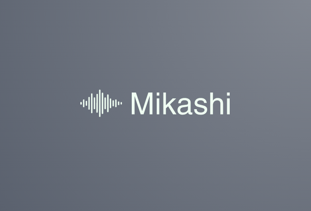

[![Contributors][contributors-shield]][contributors-url]
[![Forks][forks-shield]][forks-url]
[![Stargazers][stars-shield]][stars-url]
[![Issues][issues-shield]][issues-url]
[![MIT License][license-shield]][license-url]
[![LinkedIn][linkedin-shield]][linkedin-url]

<!-- PROJECT LOGO -->
 

  

  <h3 align="center">Mikashi</h3>

  

    Automated Lyric Search for Spotify
     
    <a href="https://github.com/leokodish/mikashi"><strong>Explore the docs »</strong></a>
     
     
    <a href="https://www.mikashi.net">View App</a>
    ·
    <a href="https://github.com/leokodish/mikashi/issues">Report Bug</a>
    ·
    <a href="https://github.com/leokodish/mikashi/issues">Request Feature</a>
  

<!-- TABLE OF CONTENTS -->

  
Table of Contents

  <ol>
    <li>
      <a href="#about-the-project">About The Project</a>
      <ul>
        <li><a href="#built-with">Built With</a></li>
      </ul>
    </li>
    <li><a href="#usage">Usage</a></li>
    <li><a href="#privacy">Privacy</a></li>
    <li<a href="#songNotFound">Why Did I Get a 404 Song Not Found?</a></li>
    <li><a href="#architecture">Architecture</a></li>
    <li><a href="#license">License</a></li>
    <li><a href="#contact">Contact</a></li>
  </ol>

<!-- ABOUT THE PROJECT -->
## About The Project

[![Product Name Screen Shot][product-screenshot]](https://www.mikashi.net)

Mikashi came about as a project centered around the Spotify Web API. I had been exploring uses for analyzing user data pertaining to liked songs and playlists, but it wasn’t until I saw that Spotify had created an API for the Spotify Player that I came up with this. This new API combined with my complete inability to hear song lyrics when I listen to songs on Spotify gave me the idea for a web app for automated lyric searching while I listened to music on Spotify.

Mikashi utilizes the Spotify Player API to get the user’s currently playing song, artist, and album. It then uses that data to construct a URL to fetch the HTML of the song’s page from either SongLyrics.com or Genius.com. Mikashi first tries to fetch the lyrics from SongLyrics and if it isn’t able to get them from there it tries Genius. 

Mikashi also allows users who don’t have Spotify accounts or users who just want to look up song lyrics directly to do that via its search feature. All the user has to do is enter the song and artist they are looking for and Mikashi fetches the lyrics for them.

A list of commonly used resources that I find helpful are listed in the acknowledgements.

### Built With

This section should list any major frameworks that you built your project using. Leave any add-ons/plugins for the acknowledgements section. Here are a few examples.
* [Node.js](https://nodejs.org/en/)
* [Express](https://expressjs.com/)
* [Pug](https://pugjs.org/api/getting-started.html)
* [Bootstrap](https://getbootstrap.com/)
* [Amazon Web Services](https://aws.amazon.com/)

<!-- USAGE EXAMPLES -->
## Usage

Use this space to show useful examples of how a project can be used. Additional screenshots, code examples and demos work well in this space. You may also link to more resources.

_For more examples, please refer to the [Documentation](https://example.com)_

<!-- Privacy -->
## Privacy
Mikashi does not store or save any user data. When you log in with Spotify, Mikashi requests an access token from Spotify that it can then use to make requests to the Spotify Web API. This access token limits Mikashi to only accessing data that has to do with the user’s music library and publicly available profile. Mikashi will not make any changes to your Spotify library. The access token is also deliberately set to expire after a set period of time, making Mikashi’s access to user data temporary and requiring the user to log in again to grant permission to access their music library.

**Authentication Flow:**
[![Spotify Authorization Flow][spotify-auth-diagram]](https://developer.spotify.com/documentation/general/guides/authorization-guide/)

*For more information: [Spotify Docs](https://developer.spotify.com/documentation/general/guides/authorization-guide/)*

<!-- SongNotFound -->
## Why Did I Get a 404 Song Not Found?
There are multiple reasons why a song may not be able to be found using Mikashi. In order to get song lyrics, the app needs to construct a URL to fetch the song lyrics from a  website like SongLyrics or Genius. For example, if the user were listening to “Memories” by Leonard Cohen and was trying to get the lyrics from Genius, then the app would need to construct the URL [https://genius.com/Leonard-cohen-memories-lyrics](https://genius.com/Leonard-cohen-memories-lyrics). If the constructed URL differed from this, then the URL would be incorrect and the response back from Genius would not contain the lyrics, resulting in Mikashi not being able to present lyrics back to the user. For most songs, the URL is able to be constructed easily since the URL just requires having the song name and artist, but there are several cases in which the data returned from the Spotify Web API makes it difficult or impossible to accurately construct the correct URL. 

One such case is when the user’s currently playing song features multiple artists. If the Spotify Web API returns an artist response object with multiple artists in it, I simply grab the first artist in the list and use that to construct the URL. The difficulty comes when Spotify doesn’t list all of the artists in the artist response object, but instead lists the featured artists directly in the song title (e.g. “Slippery (feat. Gucci Mane)”). Since I directly use the song name returned from Spotify to construct the URL without any string manipulation besides adding hyphens between whitespace, if there is extra text in the song name such as a features list or a note saying the song is a remastered version, it is almost certain that the constructed URL will be incorrect and the song will not be able to be fetched.

Another case in which a song’s lyrics may not be able to be fetched is if the song or artist contains non-English characters. Multilingual URL addresses do exist and are valid web addresses, but for the websites that I am scraping lyrics from. The URLs they create for their pages only use English characters. This is true even if the song or artist name is in a foreign script. For example, the song **あこがれ (Akogare)** by **大貫妙子 (Taeko Ohnuki)** is written using Japanese script, but Genius’ URL for the song will be [https://genius.com/Taeko-ohnuki-akogare-lyrics](https://genius.com/Taeko-ohnuki-akogare-lyrics), with the artist and song name written in Romanized form. The problem that this poses for Mikashi is that if the song or artist name returned from Spotify is written in a foreign script, there isn’t a reliable way to convert this data into a Romanized form that I can then use to construct a URL. There are services such as Google’s Translation API that can detect the language a word is in (which is necessary since the data coming in from Spotify could be in just about any language, since Spotify has music from all over the world), and provide a translation. However, a translation is not very helpful, since what I actually need in this case is a transliteration of the word, where the source word would be transferred into English in a way that maintained its pronunciation. Unfortunately, this means that for now Mikashi can only support foreign music as long as the song and artist data returned from Spotify is in English. 

Apologies in advance to the K-Pop fans, but unless the song’s title is in English or Romaja, it’s very likely you won’t be able to use Mikashi to find the lyrics to your favorite K-Pop songs. 

<!-- Architecture -->
## Architecture
Mikashi is written in Node.js and uses Express for its backend. Pug is used as a template engine to generate HTML for the front end and uses CSS for styling the front end.  

Mikashi was developed for the cloud and is hosted on AWS. It is built with a serverless architecture, so all of the infrastructure management and server provisioning is handled by AWS. AWS API Gateway creates and manages the REST API for Mikashi. When users go to Mikashi.net on their browser, the REST API is invoked and triggers the AWS Lambda function where a deployment package containing the code for the Mikashi app is stored. Lambda provisions a server (as needed) to run the app and API Gateway returns Mikashi’s entry point to the user for them to then use the app.  

The domain Mikashi.net is registered with Route 53. This combined with API Gateway allowed me to set a custom domain name for the app, so users can access the app through Mikashi.net rather than the verbose and unattractive URL that AWS auto-generates. 

**Mikashi Cloud Architecture**
[![Mikashi Cloud Architecture][aws-flow-diagram]](https://developer.spotify.com/documentation/general/guides/authorization-guide/) 

<!-- LICENSE -->
## License

Distributed under the MIT License. See `LICENSE` for more information.

<!-- CONTACT -->
## Contact

Leo Kodish - [@website](https://www.leokodish.com) - mikashi.app@gmail.com

Project Link: [https://github.com/leokodish/mikashi](https://github.com/leokodish/mikashi)

<!-- ACKNOWLEDGEMENTS -->
## Acknowledgements
* [GitHub Emoji Cheat Sheet](https://www.webpagefx.com/tools/emoji-cheat-sheet)
* [Img Shields](https://shields.io)
* [Choose an Open Source License](https://choosealicense.com)
* [GitHub Pages](https://pages.github.com)
* [Animate.css](https://daneden.github.io/animate.css)
* [Loaders.css](https://connoratherton.com/loaders)
* [Slick Carousel](https://kenwheeler.github.io/slick)
* [Smooth Scroll](https://github.com/cferdinandi/smooth-scroll)
* [Sticky Kit](http://leafo.net/sticky-kit)
* [JVectorMap](http://jvectormap.com)
* [Font Awesome](https://fontawesome.com)

<!-- MARKDOWN LINKS & IMAGES -->
[contributors-shield]: https://img.shields.io/github/contributors/othneildrew/Best-README-Template.svg?style=for-the-badge
[contributors-url]: https://github.com/leokodish/mikashi/graphs/contributors
[forks-shield]: https://img.shields.io/github/forks/othneildrew/Best-README-Template.svg?style=for-the-badge
[forks-url]: https://github.com/leokodish/mikashi/network/members
[stars-shield]: https://img.shields.io/github/stars/othneildrew/Best-README-Template.svg?style=for-the-badge
[stars-url]: https://github.com/leokodish/mikashi/stargazers
[issues-shield]: https://img.shields.io/github/issues/othneildrew/Best-README-Template.svg?style=for-the-badge
[issues-url]: https://github.com/leokodish/mikashi/issues
[license-shield]: https://img.shields.io/github/license/othneildrew/Best-README-Template.svg?style=for-the-badge
[license-url]: https://github.com/leokodish/mikashi/blob/master/nodeserver/LICENSE
[linkedin-shield]: https://img.shields.io/badge/-LinkedIn-black.svg?style=for-the-badge&logo=linkedin&colorB=555
[linkedin-url]: https://linkedin.com/in/leokodish
[product-screenshot]: nodeserver/src/assets/Mikashi_Screenshot.png
[aws-flow-diagram]: nodeserver/src/assets/Mikashi_AWS_Flowchart.png
[spotify-auth-diagram]: nodeserver/src/assets/Spotify_Auth_Flow.png